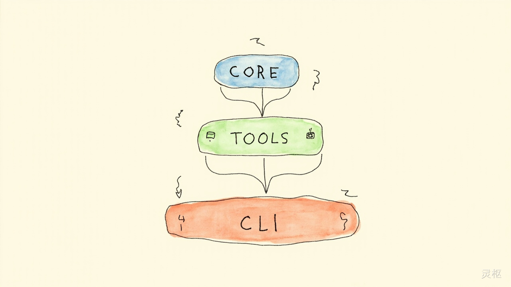

# 公众号首发文章 — 灵枢

## 标题（备选）

**主推：** 当 AI 学会"把脉"：我用自然语言管理 50 台自助购药机

**备选1：** 不写管理后台了，我让 Agent 自己管设备

**备选2：** 从 6100 行代码开始：一个终端管理 Agent 的诞生

---

## 正文

你有没有过这种体验——

凌晨三点，手机震动。某台自助购药机又离线了。你打开后台，点开设备列表，筛选区域，找到那台设备，查看日志，发现是网络模块故障。

然后你默默记下：这台设备本月第三次了。

第二天你翻后台，想找出"华东地区最近故障率最高的设备"，结果发现——后台只能按单台设备查日志，没有聚合分析。

你想骂人。


---

### 我为什么要做一个 AI Agent

我是一名医疗信息化的从业者，日常工作里有一块是管理自助购药终端——就是你在医院、药房看到的那种自助机。

设备散在全国各地，每天产生交易、故障、告警。传统的管理方式是：看后台 → 筛选 → 查日志 → 导出 → 做 Excel → 分析。

每一步都不难，但**串起来就是一堵墙**。

你想问"华东地区哪些设备离线超过 6 小时"，得自己拼条件。
你想问"故障率排名前五的设备"，得自己导数据算。
你想问"最近有没有库存风险"，得一台台点进去看。

**信息在那里，但获取信息的方式太笨了。**

于是我开始想：如果有一个"贾维斯"式的东西，我直接用中文问它，它直接给我答案，甚至主动告诉我"这台设备该巡检了"——是不是就不用跟后台较劲了？

于是，Terminal Agent 诞生了。

---

### 它是什么

Terminal Agent 是一个 AI 驱动的终端管理助手。你用自然语言和它对话，它通过工具调用查询设备数据、分析故障、执行操作。

简单说：**你问，它答，它还能干活。**

举几个真实的对话：

**你：** 查一下华东地区有哪些设备离线了

**Agent：** 找到 3 台离线设备：
1. 上海浦东-张江药房-01 — 离线 2 小时
2. 杭州西湖-文三路药房-03 — 离线 5 小时
3. 南京鼓楼-中央路药房-02 — 离线 12 小时
⚠️ 建议对离线超过 6 小时的设备安排巡检。

**你：** 把华东地区所有设备的屏幕亮度调到 80

**Agent：** 已将华东地区 12 台设备的屏幕亮度从 65 统一调整为 80。

**你：** 今天天气怎么样？

**Agent：** 我专注于自助购药机终端管理，无法查询天气信息。如果您需要管理购药机设备，我可以帮您……

最后这个回复让我特别满意。后面会讲为什么。


---

### 技术架构：三层蛋糕

如果你是技术同行，这部分是干货。

项目用了 monorepo + npm workspaces，分为三层：



```
cli → tools → core
  ↘ pi-ai, pi-agent-core
```

**core（数据层）**：定义设备、故障日志、配置等数据模型，以及内存存储和模拟数据（50+ 台设备，覆盖华东华南华北等区域）。

**tools（工具层）**：6 个 Agent 工具——查设备列表、单机状态、故障日志、统计分析、修改配置、远程重启。每个工具都有参数校验（TypeBox schema），Agent 调用时会自动验证。

**cli（入口层）**：组装 Agent = LLM + 工具 + 系统提示词。系统提示词定义了 Agent 的角色和行为规范，这是整个 Agent 的"灵魂"。

关键技术选型：

- **pi-agent-core**：Agent 运行时，负责工具调用循环（tool-calling loop）
- **pi-ai**：LLM 抽象层，支持任何 OpenAI 兼容的 API（OpenRouter、DeepSeek、本地 Ollama 都行）
- **TypeBox**：参数 schema 定义，比 JSON Schema 更简洁

为什么选这套技术栈？因为它够轻。LangChain 太重了，动不动引入一堆依赖。这套方案的核心代码量不到 2000 行，但功能完整。对于一个垂直领域的 Agent 来说，**简洁 > 功能多**。

---

### 一个有趣的发现：边界感

在开发过程中，我做了一个实验：问 Agent 一个和设备管理完全无关的问题——"今天天气怎么样？"

它回答了：

> 我专注于自助购药机终端管理，无法查询天气信息。如果您需要管理购药机设备，我可以帮您：查询设备列表和状态、查看故障日志和统计、修改设备配置、远程重启设备。

这个回复有三层意思，我觉得值得拆解：

1. **识别边界**：它知道自己不能做什么
2. **明确拒绝**：没有硬编一个天气答案敷衍你
3. **主动引导**：告诉你它能做什么，把对话拉回正轨

我检查了代码，系统提示词里**并没有显式写"拒绝无关问题"**。LLM 仅凭角色定义就自主判断出了边界。

这让我想到一个观点：**好的 Agent 不是万能的，而是知道自己能做什么、不能做什么的。** 就像一个好的医生不会跑去帮你报税，但他会告诉你"这个问题你应该找会计师"。


这也是我把公众号命名为"灵枢"的原因——灵，是灵动的智慧；枢，是核心枢纽。不是什么都做，而是在自己的领域里精准运转。

---

### Skill 系统：让 Agent 学会新技能

Agent 的能力不是固定的。我设计了一套 Skill 系统，像插件一样给 Agent 扩展新能力。

目前内置了两个技能：
- **故障智能分析**：分析高频故障设备，给出巡检建议
- **批量配置管理**：同时修改多台设备的配置

添加新技能只需要在 `skills/` 目录下创建一个文件夹，写一个 `SKILL.md` 描述文件。Agent 启动时会自动扫描加载。

这个设计借鉴了 Anthropic 的 MCP（Model Context Protocol）思想——**能力是模块化的，按需加载，而非硬编码在 Agent 里**。

未来如果要做真实设备对接，只需要写一个新的 skill，把模拟数据替换成真实的 API 调用就行。架构上已经留好了口子。

---

### 开源了

今天这篇文章，也是这个项目的"出生证明"。

项目已经开源在 GitHub 上，Apache 2.0 协议：

👉 github.com/QF1987/terminal-agent

如果你对 AI Agent 开发、LLM 工具调用、或者终端设备管理有兴趣，欢迎来看看代码，提 Issue，甚至提 PR。

目前是 MVP 阶段，用的是模拟数据。我的计划是：

- **短期**：完善文档，增加更多技能
- **中期**：对接真实设备 API，支持更多 LLM 提供商
- **长期**：做成一个通用的垂直领域 Agent 框架

---

### 最后

写这篇文章的时候，我一直在想一个问题：**AI Agent 到底在解决什么？**

不是替代人，而是消灭那些"人做起来很烦、机器做起来很笨"的中间环节。

就像灵枢这个名字——中医里的灵枢，讲的是经络和穴位。人体的经络是气血运行的通道，穴位是关键节点。一个好的 AI Agent，也应该是信息流动的经络，决策发生的关键节点。

不多说了，代码在 GitHub 上，有缘代码里见。

---

**灵枢** — AI 时代的终端管理助手

关注我们，一起探索 AI Agent 在垂直领域的落地实践。
