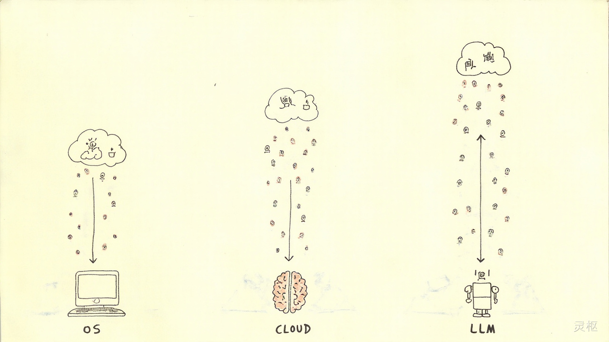
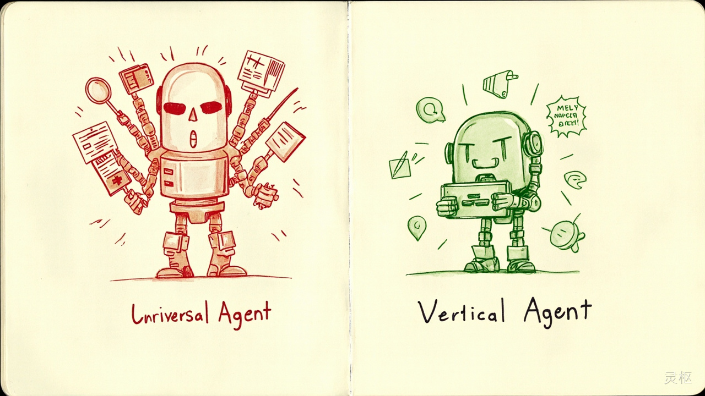
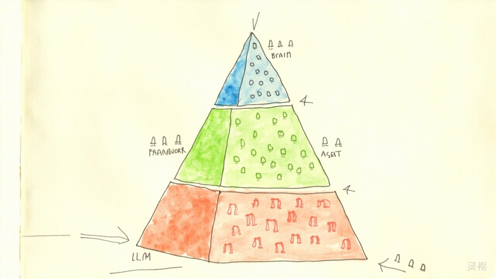

# 公众号文章二 — 灵枢

## 标题（备选）

**主推：** Agent 的终局不是"万能"，而是"专精"——垂直 Agent 的机会在哪里

**备选1：** 大模型负责"聪明"，Agent 负责"干活"

**备选2：** 为什么我说垂直 Agent 比通用 Agent 更有戏

---

## 正文

最近和几个同行聊 Agent，发现一个有意思的现象：大家都在追通用 Agent，好像谁做的 Agent 能干的事越多越厉害。

但我的判断恰恰相反。

**Agent 的终局不会是大一统，也不会是完全碎片化，而是"底座集中 + 应用分散"。**

什么意思？先看三个类比：

---

### 历史总在重演

**操作系统**就那么几个——Windows、macOS、Linux。但上面跑的 App 成千上万。

**云计算**就那么几家——AWS、阿里云、华为云。但上面的 SaaS 服务数不清。

**LLM 也一样**——大模型就那么几个。但上面的 Agent 会百花齐放。

这不是巧合，而是技术演化的规律：底层收敛，上层发散。



---

### 为什么大一统不会发生

很多人幻想一个"超级 Agent"包办一切——帮你管设备、写代码、做报表、订机票。

听起来很美，但有三道坎过不去。

**第一道坎：领域知识是护城河。**

你让一个通用 Agent 去管自助购药机，它连"处方上报接口"是什么都不知道。不是它不聪明，是它没学过。

就像你不能让一个全科医生去做心脏搭桥手术——知道心电图怎么看，和知道手术刀怎么下，是两回事。

垂直 Agent 的价值不在模型能力，在于对业务的理解、数据的接入、操作的闭环。这些东西是"用"出来的，不是"训"出来的。

**第二道坎：数据和合规壁垒。**

医疗数据不能随便喂给通用 Agent，金融、政务、工业都一样。

你愿意把几百台医疗设备的运行数据、故障记录、交易流水，上传到一个公共的 Agent 平台吗？

不愿意。这就是为什么垂直领域的 Agent 必须在私有环境跑。而私有部署，天然就排斥大一统。

**第三道坎：信任成本。**

你愿意让一个什么都干的 Agent 帮你管理几百台医疗设备，还是一个专门干这个的？

答案很明显。

医生不会因为 GPT 懂点医学就失业，但它辅助的那个专科医生会更强。Agent 也是这个逻辑——通用的打辅助，垂直的当主力。



---

### 为什么也不会完全碎片化

如果垂直 Agent 这么好，那是不是每个公司都从零开始造一个？

也不对。因为有两个力量在推动收敛：

**基座模型会越来越强。** Agent 的"脑子"还是依赖大模型。这部分会越来越集中，不是每家公司都能训得起一个 GPT。

**Agent 框架会收敛。** 就像 Web 框架大战了十年，最后 React/Vue 两家独大。Agent 的运行时、工具调用机制、协议标准，也会慢慢收敛成几个主流方案。

---

### 最终形态：三层蛋糕

把上面的分析串起来，Agent 生态大概是这样：

```
少数大模型（脑子）
    ↓
少数 Agent 框架（骨架）
    ↓
成千上万的垂直 Agent（手脚）
```



最底层是"脑子"——大模型提供推理能力，这一层会越来越集中。

中间层是"骨架"——Agent 框架提供运行时、工具调用、状态管理，这一层会收敛到几个主流方案。

最上层是"手脚"——垂直领域的 Agent 解决具体问题，这一层会百花齐放。

你现在看到的通用 Agent 产品，大多试图三层通吃。但长期来看，它们会被迫选择：要么沉下去做框架，要么聚焦到某个垂直领域。

---

### 对开发者的启示

如果你也在做 Agent 相关的事，我的建议是：

**找到你的"处方上报接口"。**

每个垂直领域都有外人听不懂、但圈内人天天用的概念。这些概念就是壁垒。通用 Agent 不会去学这些，因为 ROI 太低。但你学了，就是你的护城河。

**切口要小，做深做透。**

我自己的项目叫 terminal-agent，管的就是自助购药机终端。切口很小很具体，但反而好——小切口容易做深，做深了就有壁垒。

那些想做"万能 Agent"的，最后往往什么都做不好。


**用通用的脑子，干专业的事。**

大模型负责"聪明"，Agent 负责"干活"。你不需要自己训模型，你需要的是把领域知识、业务流程、操作闭环封装好，让通用模型在你的场景里变成"专家"。

---

### 最后

"灵枢"这个名字取自中医经典。灵，是灵动的智慧；枢，是核心枢纽。

中医不讲"包治百病"，讲的是"辨证施治"——不同的人、不同的症，用不同的方。Agent 也是这个道理。

通用的给思路，垂直的给答案。

---

**灵枢** — 垂直领域 Agent 的思考与实践

关注我们，一起探索 AI Agent 在专业场景的落地之路。
